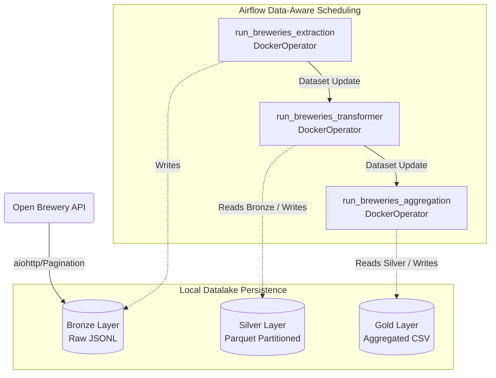

# 🍺 Breweries Pipeline

This repository contains the solution for the **Data Engineer VII Technical Case**, focusing on building a resilient and scalable Data Lake from scratch using the Medallion Architecture.

## 🏛️ Architecture and Data Flow

The architecture follows the **Medallion Architecture**, orchestrated by **Apache Airflow** and containerized using **Docker**. The pipeline consumes data from the [Open Brewery DB API](https://api.openbrewerydb.org/) and processes it through three distinct layers.



### 🥉 Bronze Layer (Raw Data)

- **Role**: Ingests raw data directly from the API.

- **Implementation**: Uses Python with `aiohttp` for asynchronous, fast data retrieval. It iterates through the paginated API endpoints to fetch all breweries.

- **Format**: Persisted as raw JSON Lines (`.jsonl`) files in the local Datlake storage.

### 🥈 Silver Layer (Cleaned & Columnar)

- **Role**: Transforms raw JSON into an optimized columnar format.

- **Implementation**: Utilizes `pandas` and `pyarrow`. Data is structured, null values in partition columns are handled, and the output is split dynamically.

- **Format**: Persisted as **Parquet**, partitioned by location (`state_province`).

### 🥇 Gold Layer (Aggregated View)

- **Role**: Provides business-ready aggregations.

- **Implementation**: Employs **PySpark** to group and aggregate data.

- **Format**: Persisted as a CSV view containing the quantity of breweries per `brewery_type` and location (`state_province`).

---

## 🛠️ Orchestration Strategy

We use **Apache Airflow** (via Astronomer) as the orchestration engine.

- **Data-Aware Scheduling**: Instead of rigid cron schedules, the pipeline uses Airflow Datasets (`DatasetAll`). The completion of the Bronze DAG triggers the Silver DAG, which, upon completion, triggers the Gold DAG.

- **Isolation**: Each extraction and transformation step runs in isolated compute environments using the `DockerOperator`.

- **Resiliency**: Each DAG defines retries (`retries: 2`) with a backoff delay (`retry_delay: 2 mins`) to handle temporary network or localized failures gracefully.

---

## 🛡️ Data Quality Considerations (Design)

To ensure data integrity throughout the pipeline, the following Data Quality dimensions are considered for future implementation, potentially using DBT:

Between Bronze and Silver:

1. **Not Empty**: Assert that there are no empty data in the Bronze layer.

2. **Completeness**: Assert that the total number of records ingested into Bronze matches the expected API "total" count header/endpoint.

3. **Uniqueness**: Enforce primary key checks (e.g., `id`) in the Silver layer to prevent duplicated brewery entries.


Between Silver and Gold:

1. **Not Empty**: Assert that there are no empty data in the Silver layer.

2. **Uniqueness**: Enforce primary key checks (e.g., `id`) in the Gold layer to prevent duplicated brewery entries.

---

## 📡 Observability and Alerting (Design)

Robust monitoring is fundamental to pipeline reliability:

- **Pipeline Monitoring**: Airflow provides native tracking of task durations, Gantt charts, and historical success rates through its UI.

- **Alerting Mechanism**: We can design alerting mechanisms using Airflow Callbacks (`on_failure_callback`). When a task hard-fails (after retries), a callback function triggers a Slack, Teams or any other webhook, delivering the DAG Run context, Log URL, and exception summary to the data engineering team.

- **Telemetry**: For broader infrastructure observability, StatsD integration can be enabled in Airflow to export task volume and runtime metrics to Grafana/Prometheus or Datadog.

---

## 🚀 How to Run the Application

This pipeline uses Astro CLI for Airflow development and standard Docker for the application containers.

### Prerequisites
1. [Docker Desktop](https://www.docker.com/products/docker-desktop) installed and running.
2. [Astro CLI](https://docs.astronomer.io/astro/cli/install-cli) installed.

### 1. Build the Application Containers
The Airflow operators spin up local docker containers to run the `bronze`, `silver`, and `gold` code. You must build these images first.

Navigate to the project root and run:
```bash
# Build Bronze Container
docker build -t breweries-bronze ./bronze

# Build Silver Container
docker build -t breweries-silver ./silver

# Build Gold Container
docker build -t breweries-gold ./gold
```

### 2. Start Apache Airflow
Navigate to the `airflow` directory and spin up the Astro environment:

```bash
cd airflow
astro dev start
```
*Note: This will download the Astronomer Airflow image and start Postgres, Scheduler, Webserver, and Triggerer containers.*

### 3. Trigger the Pipeline
1. Access the Airflow UI at `http://localhost:8080/`. Log in with username `admin` and password `admin` (or the default Astro credentials).

2. You will see three DAGs:
   - `breweries_bronze_all_breweries`
   - `breweries_silver_all_breweries`
   - `breweries_gold_all_breweries`

3. Manually trigger **ONLY** the `breweries_bronze_all_breweries` DAG.

4. Watch the magic! Once the Bronze dataset is produced, Airflow Dataset scheduling will automatically trigger Silver, and subsequently, Gold.

### 4. Verify the Data
The data lake is mounted locally in your project root at `./datalake`. Check the folders:
- `./datalake/bronze`: `breweries_*.jsonl`
- `./datalake/silver`: Parquet files partitioned by `state_province=...`
- `./datalake/gold/breweries_agg`: CSV part files with the aggregated views.
